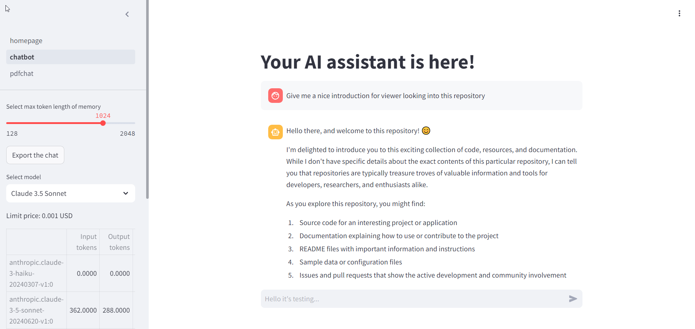

# AI Assistant

An AI assistant created with langchain and use AWS bedrock API


## Features

Currently this project support:
- Chat with wide range of models (Claude 3.5 Sonet, Claude 3 Haiku, Amazon Titan Text Premier). Support text and image. 
- View real-time API usage with cost breakdown for input tokens, output tokens.
- Export the conversation to .txt file.
- Chat with PDF using Retrieval Augmented Generation.
## Environment Variables

To run this project, you will need to add the following environment variables to your .env file

```
AWS_DEFAULT_REGION=xxxxxxx
AWS_SECRET_ACCESS_KEY=xxxxxxx
AWS_ACCESS_KEY_ID=xxxxxxx
```

## Installation

It's easy to install this project by the following commands:

```
# Clone this repo
git clone https://github.com/hoangbros03/assistantbot_bedrock.git
cd assistantbot_bedrock

# Now, evironment variables should be setup as an ".env" file

# Download poetry
pip install poetry

# Install the dependencies. Don't worry if you are using anaconda since "poetry" package will respect that
poetry install

# Run the interface
poetry run streamlit run chatbot_bedrock/homepage.py
```
## Demo


## Acknowledgements

 - [Langchain](https://www.langchain.com/)
 - [AWS Bedrock](https://aws.amazon.com/bedrock/)
